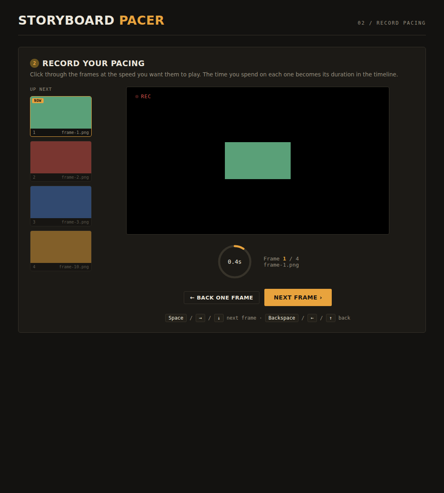

# Storyboard Pacer

[](https://github.com/jenny-chen/storyboard-pacer/releases/latest)
[](https://github.com/jenny-chen/storyboard-pacer/actions/workflows/build-macos.yml)

Time a Photoshop storyboard by clicking through your frames at the speed you want
them to play, then export a timeline that **Premiere Pro imports with every frame
already trimmed to its recorded duration** — no manual timeline trimming.

A small desktop app (macOS) built with [Tauri](https://tauri.app). Same tool as
the web version at [jennychen.ca/storyboard](https://jennychen.ca/storyboard),
but native — so it uses a real folder picker and grabs your image paths
automatically.



## Download

**[⬇︎ Download the latest release](https://github.com/jenny-chen/storyboard-pacer/releases/latest)** — grab the `.dmg` under **Assets**, open it, and drag the app to Applications.

> **First launch:** because the app isn't code-signed with an Apple Developer ID,
> macOS Gatekeeper will warn you the first time. Right-click the app →
> **Open** → **Open**. (Or run `xattr -dr com.apple.quarantine "Storyboard Pacer.app"`.)
> You only need to do this once.

The download is a **universal** build — it runs on both Apple Silicon and Intel Macs.

## What it does

1. **Load frames** — choose the folder of storyboard frames you exported from
   Photoshop (`File → Export → Layers to Files`, numbered so they sort in order).
   Frames are natural-sorted (so `2` comes before `10`) and can be drag-reordered.
2. **Record pacing** — press <kbd>Space</kbd> / arrow keys through the frames at
   the speed you want them to play. The app times how long you hold each one.
3. **Review** — a table of per-frame durations, running timecode, and totals;
   fine-tune any number.
4. **Export** — save an FCP7/xmeml `.xml`. In Premiere Pro, `File → Import` it to
   get a sequence named **Storyboard Animatic** with each frame already trimmed.

**Why:** Premiere's native still-image import gives every frame the *same* fixed
duration. This produces per-frame timing that Premiere accepts via its supported
XML import path. Exporting only ever writes the new `.xml` — your original frames
are never modified.

### Keyboard

| Key | Action |
| --- | --- |
| <kbd>Space</kbd> / <kbd>→</kbd> / <kbd>↓</kbd> | Next frame (start / advance / finish) |
| <kbd>Backspace</kbd> / <kbd>←</kbd> / <kbd>↑</kbd> | Back one frame |

## Building it yourself

You don't have to — the [Releases](https://github.com/jenny-chen/storyboard-pacer/releases)
have prebuilt `.dmg`s. But if you want to build from source:

### In the cloud (no local toolchain)

Push to GitHub and let the included workflow build it on GitHub's macOS runners:

- **Actions** tab → **Build macOS app** → **Run workflow** → download the
  `storyboard-pacer-macos-dmg` artifact, **or**
- push a tag to publish a Release with the `.dmg` attached:
  ```bash
  git tag v0.1.0 && git push origin v0.1.0
  ```

### Locally (on a Mac)

Prereqs: `xcode-select --install`, [Rust](https://rustup.rs), and
[Node.js](https://nodejs.org) 18+.

```bash
npm install
npm run tauri icon app-icon.png   # one-time: generate the icon set
npm run dev                        # live dev window
npm run build                      # -> src-tauri/target/release/bundle/{macos,dmg}/
```

## Customizing

- **Icon:** replace `app-icon.png` (1024×1024) and re-run `npm run tauri icon app-icon.png`.
- **Window / name / bundle id:** `src-tauri/tauri.conf.json`.
- **Look & feel:** `src/styles.css`. **Tool logic:** `src/main.js`.

## Project layout

```
.
├─ app-icon.png                       # source icon (1024x1024)
├─ package.json                       # Tauri CLI + scripts
├─ .github/workflows/build-macos.yml  # cloud build -> .dmg
├─ docs/screenshot.png
├─ src/                               # frontend (no build step)
│  ├─ index.html
│  ├─ styles.css
│  └─ main.js                         # tool logic + native dialog / file calls
└─ src-tauri/                         # native shell
   ├─ Cargo.toml
   ├─ tauri.conf.json
   ├─ build.rs
   ├─ capabilities/default.json
   └─ src/{main.rs,lib.rs}            # list_frames + save_file commands
```

## License

MIT — see [LICENSE](LICENSE).
